## Hi, I'm Artur

**Front-end / Full-stack Developer** — Vue & Node.js · Wrocław, Poland

Vue for ~5 years, backend-oriented (Node.js, Express, APIs).
Into clean code, maintainable architecture, and solving real problems.
AI is part of my daily workflow — previously worked on AI solutions for developers (AI Guild).

*Outside code: electric guitar, chess (e4), gym + running + cycling, late-night reading.*

---

### Ulubione technologie

- **Front-end:** Vue 3 (Composition API, Nuxt, Pinia, Vite), TypeScript
- **Backend:** Node.js, Express.js — high-performance APIs
- **Data & types:** PostgreSQL, MongoDB, Drizzle ORM, Zod (end-to-end type safety)
- **Reliability:** Redis, Pino — caching, logging, monitoring, rate limiting
- **Testing & QA:** Vitest, Jest, Mocha + Chai + Sinon, Cypress
- **AI workflow:** multiple tools in daily use, a personal base of proven solutions, and solid understanding of different LLM use cases (code, docs, refactor, review, ideation)

### Tech stack

                    

---

### Recent projects (DAAP)

| Project | Description | Tech |
|--------|-------------|------|
| **[daap.pro](https://daap.pro/)** | Company site — MES systems, production integration, web apps & automation (ERP/MES/WMS). | Nuxt, TypeScript, GSAP, Three.js |
| **[ur.daap.pro](https://ur.daap.pro/)** | Web app (frontend) — product frontend for DAAP solutions. | Vue, TypeScript, Node, Express, PostreSQL, drizzle-ORM, Zod|
| **[MES by DAAP (demo)](https://demo.daap.pro/login)** | MES/CMMS demo — dashboards, production monitoring, ERP/MES/WMS integration. | Vue 3, TypeScript, Node, Express, MongoDB |

---

### Experience (highlights)

- **SAIE/DAAP** (01.2022–01.2026) — Freelance Frontend Developer. Production Management System (Dolina Noteci): advanced system supporting industrial production processes; Production Management System design (Hochland).
- **Symfonia-Mid** (08.2022–12.2025) — Frontend Developer, HR system: core components, Vue 2→3 migration, AI Guild (AI-driven solutions), code reviews, UI/UX
- **Creativium** (03–08.2022) — Junior Frontend Developer: product configurator, performance with large datasets, MES design (Hochland)

---

### Other projects (from experience)

- **Comprehensive MES** (Dolina Noteci) — production & maintenance support (Vue 2/3, TypeScript, Python)
- **HR System** (Symfonia) — corporate HR management (Vue 3, TypeScript, Vite, Vitest, Cypress, Docker)
- **AI-Powered Training System Builder** — hybrid athletes, AI support (Vue 3, Vite, TypeScript, Node, Express, Drizzle, Zod, Vitest, Vuetify)

---

### GitHub stats

---

### Featured repo

- **[organizer](https://github.com/ArturFracek/organizer)** — Week organiser with time tracking and activity prioritisation (Vue).

---

### Let's talk

📬 **Email:** [arturfracek7@gmail.com](mailto:arturfracek7@gmail.com)  
📱 **Phone:** +48 513 354 614  
💼 **LinkedIn:** [linkedin.com/in/artur-fracek](https://linkedin.com/in/artur-fracek)
