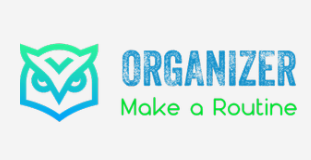

## Hi, i'm Artur

Heavy riffs, melodic solos on electric guitar, fingerstyle arrangements on acoustic. A classic e4 chess player. Nocturnal book reader. At the gym, I train my legs.

- 💻 I'm currently developing for writing unit tests
- 📖 Focused on Vue.js
- 🎯 I'm aiming to master MEVN Stack

## Languages and tools

<code></code>
<code></code>
<code></code>
<code></code>
<code></code>
<code></code>
<code></code>
<code></code>
<code></code>
<code></code>
<code></code>
<code></code>
<code></code>
<code></code>
<code></code>

|  |  |
| ------------- | ------------- |

#### Top Repositories

---

## Let's talk

📬 Feel free to contact me: arturfracek7@gmail.com